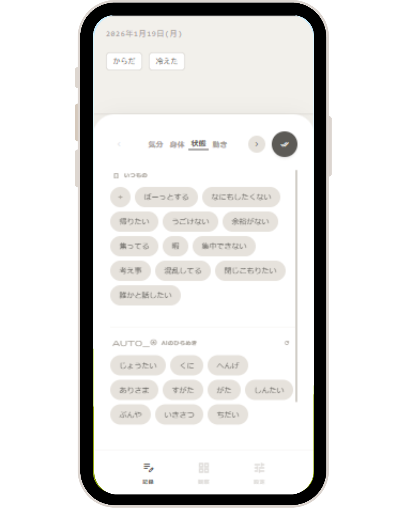

# Log. - 凪の記録 (Nagi)

<!-- ※リポジトリ内の docs/images フォルダに、スマホ枠にはめたアプリのスクショを置いてください -->

> **「評価しない」「責めさせない」「ただ置く」**
> 思考と記述を切り離し、今の状態に近い単語をただキャンバスに置いていく。
> それ以上でもそれ以下でもない、ジャーナリングツール。

## 🌊 哲学 (Philosophy)

このアプリケーションは、一般的な日記アプリにある「自己省察」や「生産性」の圧力から、**静かに距離を置く**ために設計されました。

*   **Neutrality (中立):** ユーザーを褒めることも、叱ることもしません。導きもしません。
*   **Fact-Based (事実の配置):** 文章を綴る必要はありません。「気分」や「身体」などのカテゴリから、今の状態に近い**単語を選んでキャンバスに置く**だけのUIです。
*   **Silence (静寂):** 記録がない期間を「サボり」ではなく「静かな時間の気配」として可視化します。

## 🧠 開発プロセス：AIオーケストレーション (Meta-Orchestration)

本プロジェクトは、非エンジニアである私が企画・要件定義を行い、コーディングのほぼ全てを **Google AI Studio** が担当する「AI共創」体制で開発されました。

開発が長期化し、数十万トークンに及ぶ対話履歴によってAIの挙動が不安定になった際（仕様の逸脱や幻覚など）、以下のプロセスを用いてコントロールを行いました。

1.  **Context Freeze (文脈の固定):**
    これまでの膨大な対話とコードをAI自身に解析させ、「絶対に守るべき仕様」「変更してはいけない哲学」を抽出。
2.  **Blueprint Generation (憲法の制定):**
    上記に基づき、開発の指針となる設計図 `blueprint.md` をAIに生成させる。
3.  **Anchoring (アンカリング):**
    以降のプロンプトには常に `blueprint.md` を参照させ、AI自身が定めたルールをAIに遵守させることで、開発のブレを完全に抑制。

この「AIにAIを管理させる」アプローチにより、複雑な機能と繊細なUIを持つアプリケーションの実装を完遂しました。

## 📱 機能 (Features)

*   **単語配置UI:** テキスト入力の負荷を排除。プリセットされた「感覚」「質感」などの単語をタップして配置します。
*   **AI共鳴 (Gemini Integration):** Google Gemini APIを活用し、選択したカテゴリに基づいた抽象的な語彙（例：「きらきら」「しんとした」など）をAIが提案・拡張します。
*   **Atmosphere Visualization:** 記録の空白期間を、美しいグラデーションの「気配」として視覚化。
*   **Zero-Server Architecture:** サーバーを持たず、全てのデータはブラウザ内の `IndexedDB` に保存。プライバシーを最優先したローカル完結型です。

## 🛠️ 技術スタックと設計思想 (Tech & Architecture)

あえてモダンなビルドパイプラインを排除し、**「永続性」と「手軽さ」**を突き詰めたアーキテクチャを採用しています。

| Category | Technology | Reason |
| :--- | :--- | :--- |
| **Frontend** | React 18 (CDN) | ビルド不要で、ファイルを開けば即座に動作するポータビリティを重視。 |
| **Styling** | Tailwind CSS (CDN) | デザインの微調整とダークモード対応の迅速化。 |
| **Database** | Dexie.js (IndexedDB) | 外部サーバーに依存せず、ユーザーの手元にデータを永続化するため。 |
| **AI** | Google Gemini API | ユーザー自身のAPIキーを利用することで、従量課金リスクをゼロにしつつ高度な推論を利用。 |
| **Platform** | PWA (Standalone) | iOS/Androidのホーム画面に追加し、ネイティブアプリとして振る舞うUX。 |

### Single-File Philosophy (単一ファイルの思想)
手帳やペンに「サービス終了」が存在しないように、このアプリもまた、外部環境の変化によって奪われない道具であることを目指しました。

`index.html` 単一ファイルで完結する構造は、ブラウザさえあれば——たとえAPI連携が途絶えたとしても——記録という最も根源的な機能が永続的に動作することを保証するための設計です。

## 🚀 使い方 (How to use)

1.  [https://mi701.github.io/words_log_app/] にアクセス（または `index.html` をローカルで開く）。
2.  「設定」タブで Gemini API キーを入力（オプション）。
   *   APIキーなしでも、内蔵された基本語彙セットで十分に利用可能です。
3.  「記録」タブで、今の気配に合う単語を選んでください。

## 🕰️ Digital Artifact (デジタル・アーティファクトとして)

私はエンジニアではありません。そのため、複雑なサーバー構築やデータベース連携を行う方法を知りませんでした。
しかし結果として、このアプリは `index.html` という単一のファイルになりました。

これは、クラウドサービスの終了や、サブスクリプションの期限切れに怯える必要がないことを意味します。
このファイルが手元にある限り、10年後も、あるいは私がこの世を去った後でも、
ブラウザさえあれば「静かな時間」はそこに立ち上がり続けます。

最新の技術スタックではありませんが、
「日記」という個人的な記憶を預ける器として、これが最も誠実な形だと信じています。

---
*Created by mi701*